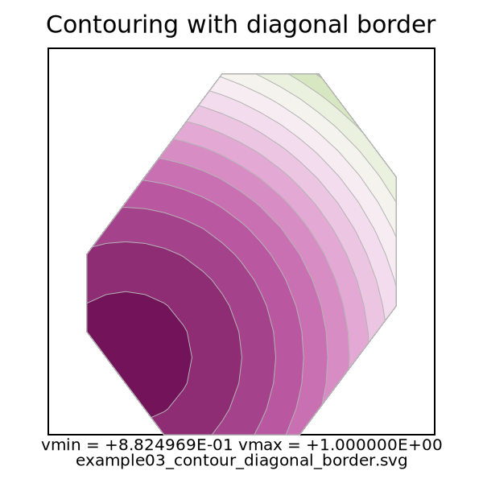
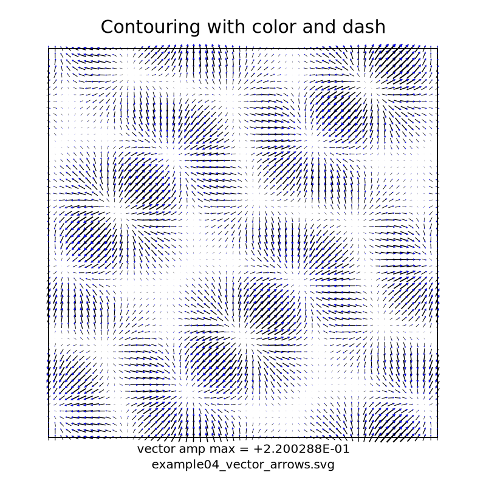

# slisvg: SVG-Based Visualization Library of Slice Data

slisvg is a Fortran library for visualizing two-dimensional slice data from numerical simulations in SVG format. 
It supports scalar-field contours, vector-arrow glyphs, and animated SVG arrows. 
The generated SVG files can be viewed in standard web browsers without additional visualization software.

## Requirements

- gfortran
- GNU make
- Python 3

## Build

```sh
cd src
make install
```


## Examples

| Directory | Description |
|---|---|
| `example01_contour_fullbox` | Scalar contour plot on a rectangular slice |
| `example02_contour_dashed` | Dashed contour lines |
| `example03_contour_diagonal_border` | Contours with a non-rectangular boundary |
| `example04_vector_arrows` | Vector-field arrow glyphs |
| `example05_vector_arrows_animation` | Animated vector arrows |
| `example06_vector_arrows_animation2` | Alternative animated arrows |
| `example07_mandelbrot` | Example scalar visualization using the Mandelbrot set |

## Run Examples

```sh
cd examples/example04_vector_arrows
make
```

## License

This project is licensed under the MIT License. See [LICENSE](LICENSE) for details.

## Sample image (example05)
<!--
    [](docs/images/example03_contour_diagonal_border.svg)
    [](docs/images/example07_mandelbrot.svg)
    [](docs/images/example04_vector_arrows.svg)
-->
[](docs/images/example05_vector_arrows_animation.svg)
